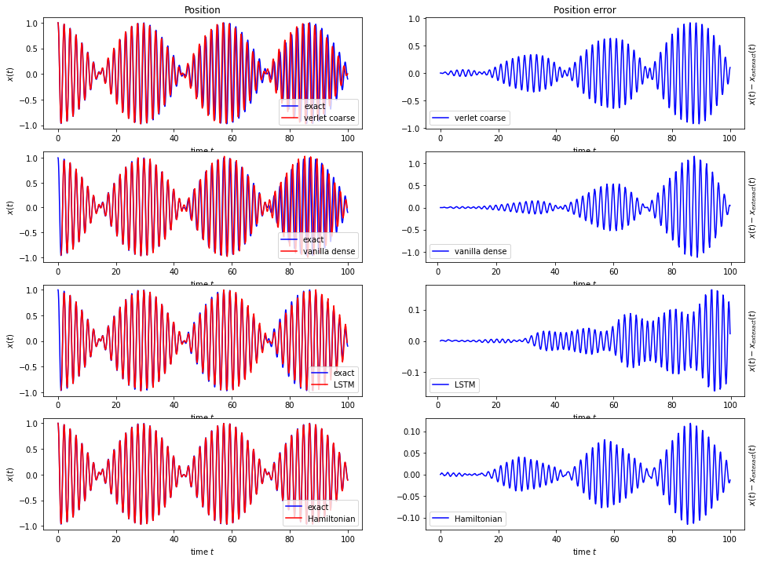
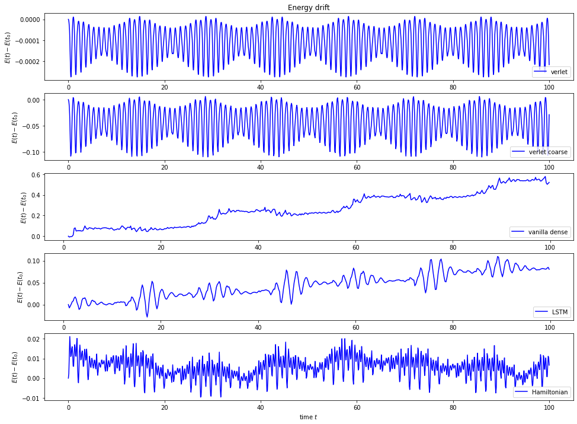

# Neural-network based integrators for dynamical systems
This code implements neural-network based numerical timestepping methods for dynamical systems. The central idea is that - if suitably trained - the neural network based integrators can achieve high accuracy even if the timestep in the numerical integration is large.

The s-step method described in [Greydanus et al. (2019)](https://arxiv.org/abs/2004.06493) is used to solve general dynamical systems. Both the LSTM based network (as described in the paper) and a simpler dense neural network have been implemented here.

In addition, for Hamiltonian systems the approach in [Kadupitiya et al. (2020)](https://arxiv.org/abs/1906.01563) can be used. The Hamiltonian of the dynamical system is represented by a dense neural network and this is then used in a symplectic Verlet integrator. This has the advantage that the numerical integrator preserves the symplectic structure. Usually it is assumed that the Hamiltonian is separable, and the kinetic- and potential energy are represented by different neural networks. This, however, is not true for several dynamical system (such as the double pendulum) and it does not necessarily lead to the best learned Hamiltonian. To overcome this issue we also implemented the approach in [Tao (2016)](https://arxiv.org/abs/1609.02212), where an explicit timestepper for non-separable systems is introduced.

## Training
In all cases the neural network based integrators are trained by running a standard numerical integrator (for example the Verlet method) to generate ground truth trajectories. By starting from random initial conditions, this allows sampling the phase space.

### Automatic C-code generation
Generating training samples can be expensive since it requires running the high-resolution training integrator for a large number of timesteps. To make this more efficient, C-code is automatically generated and run with the [ctypes library](https://docs.python.org/3/library/ctypes.html). For this, each dynamical system in [dynamical_system.py](src/dynamical_system.py) contains C-code snippets for evaluating the derivative of the Hamiltonian. Inside the numerical time integrators in [time_integrator.py](src/time_integrator.py) these snippets are the combined with C-wrapper code and compiled into a library, which is executed when the timestepper is run. For more details, see the `_generate_timestepper_library()` method in [time_integrator.py](src/time_integrator.py), which might have to be adapted to compile the C-code on a particular system.

## Dynamical systems
Currently, the following dynamical systems have been implemented:
* a simple harmonic oscillator
* the classical double pendulum
* a system of two pendulums which are suspended from the ceiling and coupled with a spring that follows Hooke's law.

## Mathematical details
Further mathematical details can be found in [this notebook](NNIntegrators.ipynb).

## Code structure
The top level code is collected in Jupyter notebooks:
### Notebooks
* [TrainNNIntegrators.ipynb](src/TrainNNIntegrators.ipynb) Train neural network based integrators. Use this notebook to train one of the neural network based integrators for a particular dynamical system.
* [EvaluateNNIntegrators.ipynb](src/EvaluateNNIntegrators.ipynb) Evaluate the trained neural network based integrators by plotting the error and energy drift that arises when integrating over a long time interval.
* [VisualiseLossHistories.ipynb](src/VisualiseLossHistories.ipynb) Visualises loss histories for different integrators (these were exported from tensorboard as `.csv` files).
* [VisualiseIntegrators.ipynb](src/VisualiseIntegrators.ipynb) Visualise trajectories in phase space for standard integrators and the harmonic oscillator system. This is really just used to check that the integrators in [time_integrator.py](src/time_integrator.py) work as expected.

### Python modules
* [auxilliary.py](src/auxilliary.py) General auxilliary code. At the moment this only implements json decoders and encoders for numpy arrays, which are used for storing the weights of the bespoke Hamiltonian neural networks in [nn_integrator.py](src/nn_integrator.py).
* [models.py](src/models.py)
* [dynamical_system.py](src/dynamical_system.py)
* [data_generator.py](src/data_generator.py)
* [time_integrator.py](src/time_integrator.py)
* [nn_integrator.py](src/nn_integrator.py)

## Testing
A set of unit tests which can be run with `pytest` are collected in the directory `src/tests`.

## Results
The following plot show the position and the position error for the first pendulum in a system of two coupled pendulums. In the first row, the Verlet integrator for the exact Hamiltonian is run with a large timestep (marked *verlet coarse*). The second and third row show results for the neural network 6-step method with a dense network (marked *vanilla dense*) and LSTM network (marked *LSTM*) respectively. The final row is the Hamiltonian neural network integrator (marked *Hamiltonian*). 

The energy drift is visualised in the next plot for the same integrators; the results for a symplectic integrator with the (much smaller) training stepsize is also shown in the very first row.

