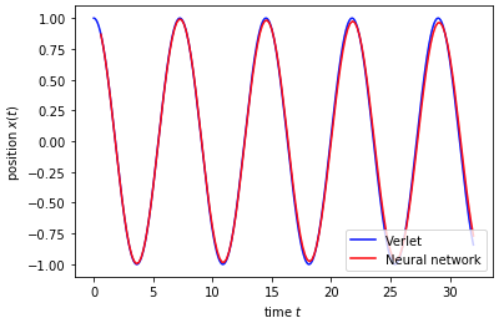
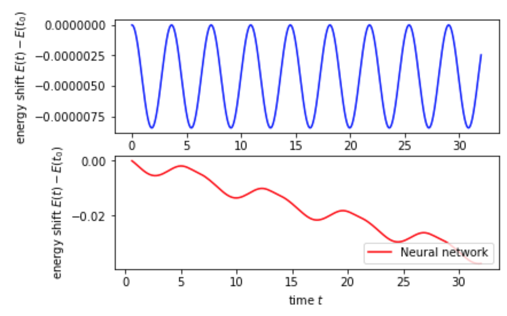

## Neural-network based integrator for dynamical systems

This code implements an s-step method for integrating dynamical systems of the form dy/dt = N(y(t)). Given the solution y(t) at s previous points in time, the value of the solution is predicted at the next timestep. For this, the correction is parametrised with a neural network, following the ideas in
[https://arxiv.org/abs/2004.06493](https://arxiv.org/abs/2004.06493). Currently the code uses a simple dense network (instead of the LSTM architecture proposed by the authos) and is trained with a simple Verlet integrator is used for training.

See [Jupyter notebook](http://htmlpreview.github.io/?https://bitbucket.org/em459/neuralnetworkintegrators/src/master/NNIntegrator.html) for a html version of the code.

### Results
The following plot shows the numerical solution, obtained both with a standard Velocity Verlet integrator and a four-step neural network based integrator. The timestep size of the latter is 20x larger, which makes the NN-based integrator potentially more efficient.

In contrast to the symplectic Verlet integrator the NN based integrator shows a non-vanishing energy drift:

The training history of the loss function is shown in the following figure:

Note that the RMSE error can not be reduced below the accuracy of the Verlet integrator that is used for training.

### Code structure
The main code is contained in the Python notebook `NNIntegrator.ipynb`, which implements the neural network model and training loop.

Classes for dynamical systems are implemented in `dynamical_system.py`, and several classic integrators (forward Euler, Velocity Verlet) are implemented in `time_integrator.py`. Currently, a simple one-dimensional harmonic oscillator is implemented.
